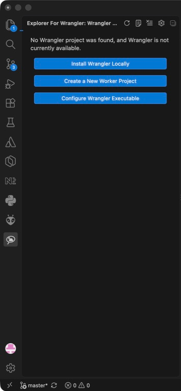

# Explorer for Wrangler

Explorer for Wrangler puts common workflows for Wrangler, the Cloudflare® Developer Platform command-line interface, in the VS Code Activity Bar. It discovers every `wrangler.jsonc`, `wrangler.json`, and `wrangler.toml` in the workspace, reads configured bindings, and runs the project-local Wrangler version in an interactive VS Code task terminal.

> **Independent project:** This extension is not affiliated with, authorised by, sponsored by, or otherwise approved by Cloudflare, Inc. Cloudflare and Cloudflare Workers® are trademarks and/or registered trademarks of Cloudflare, Inc. in the United States and other jurisdictions. Wrangler is a product of Cloudflare, Inc.



## Features

- Multi-root and monorepo project discovery
- Explicit top-level, staging, production, or custom environment selection
- Live authentication status from `wrangler whoami`, plus login and confirmed logout actions
- Project-local, explicitly configured, and system-wide Wrangler resolution
- Wrangler installation-source and version display, with cached update-availability checks
- Conditional project-local updates and an option to install Wrangler in the project when the active executable is system-wide
- Buttons for `dev`, `deploy`, deploy dry-run, `tail`, `types`, and startup checks
- Project actions, configured bindings, deployed Worker state, and Wrangler tooling grouped by their actual scope
- Authentication status, version listing, secret-name listing, and interactive secret creation
- A separate, collapsed-by-default account-resource view for D1, R2, KV, Queues, Vectorize, Hyperdrive, Workflows, Pipelines, Containers, and Secrets Store
- Configured D1, R2, KV, Queue, Durable Object, Vectorize, Hyperdrive, Workflow, Pipeline, and Secrets Store bindings
- Expandable D1 migration controls with pending-migration inspection and confirmed Local, Preview, and Remote application
- R2 bucket info
- JSON, JSONC, and legacy TOML configuration support
- Native empty-state onboarding for installation, project creation, initialization, dashboard import, and config-only setup
- Contextual Status Bar project/environment state and quick actions
- Per-project recent operation state with direct access to detailed output
- Cancellable progress and completion/error notifications for bounded operations
- Automatic remote account-resource discovery with an explicit refresh action
- Deployment and version tables, version detail panels, and confirmed production rollback
- KV key/value browsing and R2 object-key navigation with upload, download, and confirmed deletion
- D1 SQL editor with local/remote execution and a results grid
- Queue delivery controls and purge, Vectorize index/vector inspection, Hyperdrive details, Workflow details/instances/triggering, and Pipeline details
- Live status for interactive Wrangler tasks and bounded operations, plus structured Problems diagnostics
- A Worker-aware **Open Cloudflare Dashboard** deep link that respects the selected Wrangler environment and account

Explorer for Wrangler delegates to Wrangler instead of reimplementing Cloudflare APIs. Authentication remains with Wrangler, and secret values are entered only into Wrangler's terminal prompt.

## Requirements

Wrangler 4 or newer can be installed in the project:

```sh
npm install -D wrangler@latest
```

Alternatively, a system-wide `wrangler` on `PATH` is supported. Resolution defaults to an explicitly configured `explorerForWrangler.wranglerPath`, then the nearest project-local `node_modules/.bin/wrangler`, then the system `PATH`. Turn off `explorerForWrangler.preferLocalWrangler` to prefer the system installation over a local one.

If Wrangler is missing, the extension offers to install it using the lockfile-detected package manager.

## Project setup

When no Wrangler configuration is found, the Explorer shows native setup actions instead of an empty tree:

- **Create a New Worker Project** runs Create Cloudflare interactively in a terminal.
- **Initialize a Basic Worker Here** runs `wrangler init` after confirming the target folder.
- **Import a Worker from the Dashboard** runs `wrangler init --from-dash`.
- **Add wrangler.jsonc Only** creates a minimal configuration without modifying source files.
- **Install Wrangler Locally** uses the workspace's detected npm, pnpm, Yarn, or Bun lockfile.
- **Configure Wrangler Executable** supports externally managed installations.

Project-local Wrangler installations can be updated explicitly from the project context menu or Status Bar menu. System-wide and configured executables are reported as externally managed rather than being modified automatically.

## Usage

1. Open a folder containing a Wrangler configuration file.
2. Select the lasso-and-clouds icon in the Activity Bar.
3. Choose an environment, select a configured binding, then use its inline or context-menu actions. Expand a configured D1 database to create, inspect, and apply migrations for Local, Preview, or Remote targets. Resource rows are selection-only, so double-clicking a row cannot run an action twice.

The main **Wrangler Projects** view keeps project actions, bindings, deployed Worker state, and Wrangler authentication/tooling together. Expand the separate **Cloudflare Account Resources** view when you need to inspect resources beyond those configured as bindings in the current project.

Migration application first checks the selected target for pending files. Preview and Remote D1 migrations require an explicit modal confirmation showing the database and active environment. Destructive resource deletion is intentionally outside the initial release.

## Command output

Explorer for Wrangler chooses its output surface according to the operation:

- `dev`, `tail`, login, logout, Wrangler installation, and secret entry use interactive task terminals.
- Read-only lists, resource details, deployment/version data, and D1 results use structured webviews. Wrangler JSON is rendered as fields and tables, including D1 `data_types`, rather than shown as a raw JSON dump.
- Actions such as deploys and D1 migration application use cancellable progress notifications, while their command logs stream to the **Explorer for Wrangler** Output Channel.
- Output is preserved by default. Use **Wrangler: Clear Output** manually, or choose the Explorer title-bar gear (**Wrangler: Configure Explorer**) and enable **Clear Output Before Command**.
- Success and failure notifications link to detailed output; failures can be retried in a terminal.
- Identical bounded commands and interactive tasks cannot be started again while already running. These flags exist only in memory and are reset whenever the extension starts.
- The latest bounded operation remains visible beneath its project in the Explorer.
- Interactive Wrangler tasks also publish running/completed/failed state beneath their project.
- Parseable Wrangler errors and warnings are surfaced in VS Code's Problems view.
- The Status Bar follows the active editor's nearest Wrangler project and opens a quick-action menu.

## Storage browser notes

Wrangler provides remote KV key listing, so the KV browser can enumerate and inspect keys. Wrangler currently has no R2 object-list subcommand; the R2 panel therefore navigates known object keys and supports inspection, download, upload, and confirmed deletion without reading Cloudflare credentials directly.

## Security model

Commands use `ShellExecution` with separate arguments and the project-local Wrangler binary. The extension never reads or stores Cloudflare tokens or secret values. Remote mutation actions should always be visibly labeled and confirmed.
